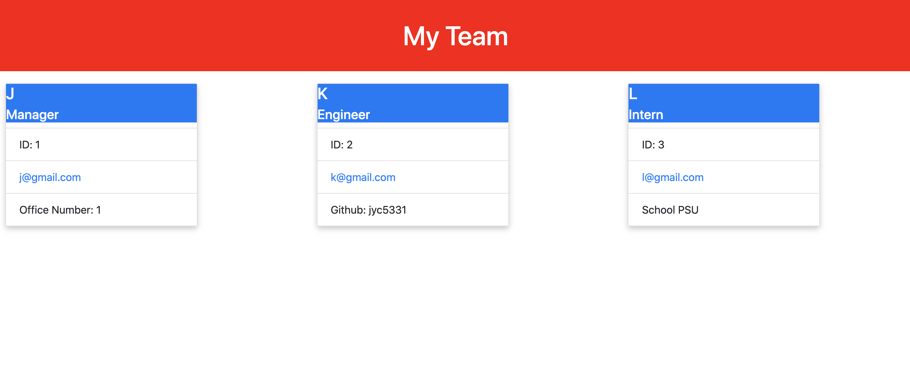

This application will allow the user to generate a dynamic HTML website using command line inputs.

The application uses node.js, HTML, and CSS. The application was written by GitHub user jyc5331 using TDD and tested with Jest.

A video walkthrough of the application can be found here: https://drive.google.com/file/d/1anjvIbTNSBH8eSQvEi85UuWLTOvHjuVn/view?usp=sharing

